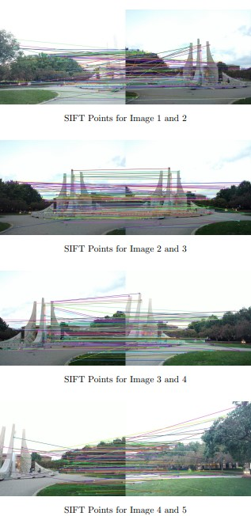
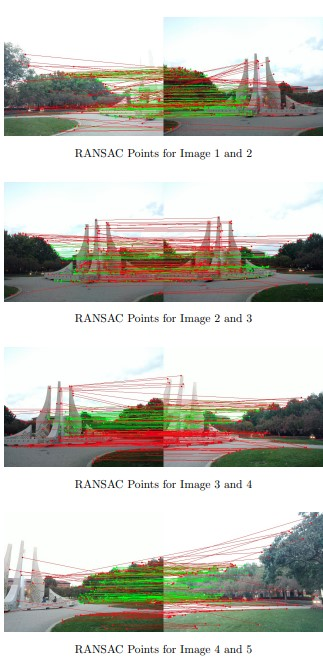
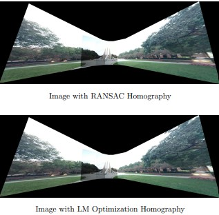

# 🖼️ Robust Homography Estimation and Panoramic Image Stitching  

This repository contains **Homework 5** from the **Purdue ECE 661 - Computer Vision** course taught by **Professor Avinash Kak**. More information about the course can be found on his website: [Avinash Kak's Computer Vision Page](https://engineering.purdue.edu/kak/computervision/).  

## 📋 Project Overview  
In this assignment, we implement a fully automated system for robust **homography estimation** and **panoramic image stitching**:  
- Enhanced interest point correspondences using the **RANSAC algorithm** to reject outliers.  
- Obtained initial homography estimates using **linear least-squares methods**.  
- Refined homographies with **Nonlinear Least-Squares minimization** techniques, such as the **Levenberg-Marquardt algorithm**.  
- Applied the workflow to overlapping images to generate a seamless panorama, demonstrating robustness in the presence of outliers.

## Setup 
Have 5 images that overlap slightly and place then in the same repository as the hw5_new.py file. Then change the paths to those images at the top of the main function.

## 🚀 Tech Stack  
- **Programming Language**: Python  
- **Tools**: OpenCV, NumPy, SciPy, Matplotlib  

## 📷 Images  
Below are examples of the results produced by this project:   

  
  

### Output Panorama  
  

